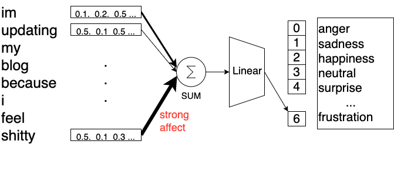
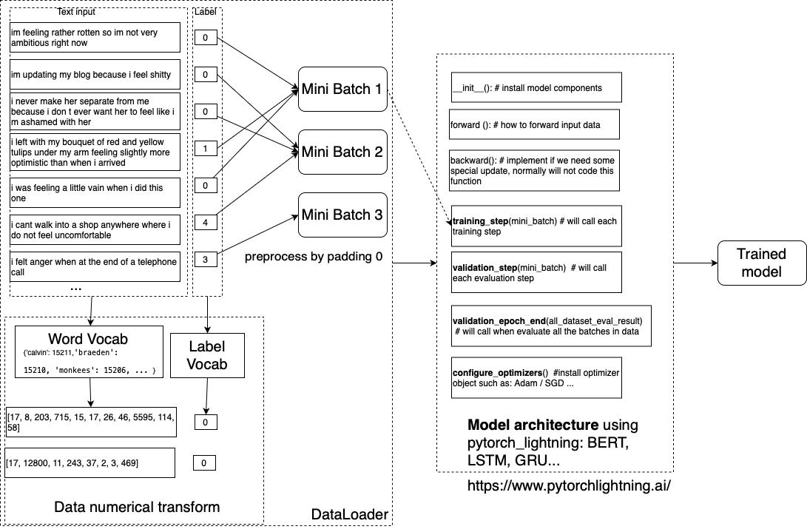

## Overview of Deeplearning system 
1. **DataLoader**: load data from files and split it into minibatch. this process is supported by pytorch_lightning library (https://pytorch-lightning.readthedocs.io/en/stable/)
   1. generate word vocab to convert input sentence to the number (check this [data_loarder source file](./src/0.data_loader_sample.ipynb) and take a look to the [dataset example](./src/1.emotion_dataset.ipynb) )
   2. generate the label vocab to convert output label to the number (check [vocab_generator source file](./src/2.emotion_vocab_generation.ipynb))
   3. design function add padding to the input sentence if it necessary  
2. **Model architecture**: 
   1. implement all the important functions (check the bellow image)
      1. learn the FFN network via an examples: 
         1. construct NN not using library [example1](./src/SimpleNN/1.FFN_no_lib.ipynb) 
         2. and using `torch.nn`, `torch.optim` libraries [example2](./src/SimpleNN/2.FFN_torch_lib.ipynb) 
         3. Do [exercise 4](./src/SimpleNN/3.ex4.FFN.ipynb) and [exercise 5](./src/SimpleNN/ex5.FFN_emotion.ipynb) .. [exercise 8](src/SimpleNN/iemocap_roberta.py)
   2. check the optimizer function (Adam/SGD/Adagrad/..) and learning rate values 
   4. <span style="color:red">write log using tensorboard</span>.
      1. learn the pytorch lightning object 
      2. learn how to log tensorboard and open it.
         1. install tensorboard `pip install tensorboard tensorboardX`
            > **Note**: when  you install package tensorboard, pytorch lightning logging will saved in tensorboard object for visualization. 

         2. **Exercise**: Modify file `src/SimpleNN/9.iemocap_roberta.py` for tensorboard logging. In the `training_step` or `valid_step` function of Pytorch lightning object, using ```self.log(`attribute_monitor`, `values`)``` to save the values to tensorboard object. For example: `self.log('valid_f1', 0.6)`
         3. Run `tensorboard` server on the VScode terminal. 
            ```
            tensorboard --host 0.0.0.0 --port 6009 --logdir "."
            ```
            and access to it via a web browser (e.g., Chorme, [http://spcc-a100g02:6009](http://spcc-a100g02:6009)) 
           
    
        


3. **Exercises**
   1. Fix the error in the this code [ex1](src/0.ex1.ipynb). Why it is error?   
   2. Design a TextPreprocessor for data_loader  [ex2](src/0.ex2.ipynb). 
   3. Code a DataLoader from `emotion` dataset  [ex3](src/2.ex_dataloader.ipynb). 
   4. Design a FFN model to predict next 10 numbers of a magic array [ex4](./src/SimpleNN/ex4.FFN.ipynb).
   5. Design a FFN model for sentence classification, using `emotion` dataset [ex5](./src/SimpleNN/ex5.FFN_emotion.ipynb) (require finised all previous exercises).  Desing a FFN Neural network that learn to classify the emotional label of a given input sentence. We assum that, each word in the input sentence have a weight affect to the label. To this end, we need to learn these hidden weights. 
      

4. **Overview of a ML system** 


   

##  Python ENV 

```cmd
    conda create --prefix=./env_py38  python=3.8
    conda activate ./env_py38 
    pip install -r requirements.txt
```

